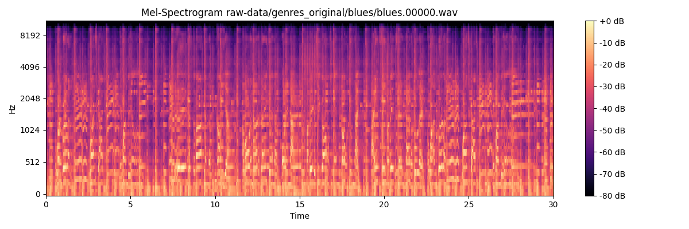
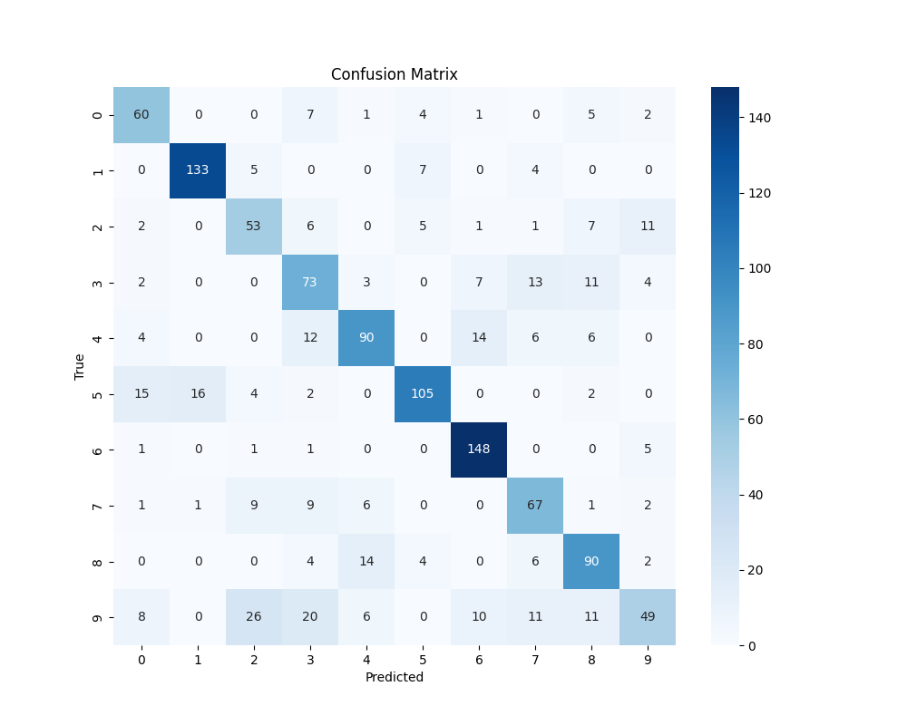
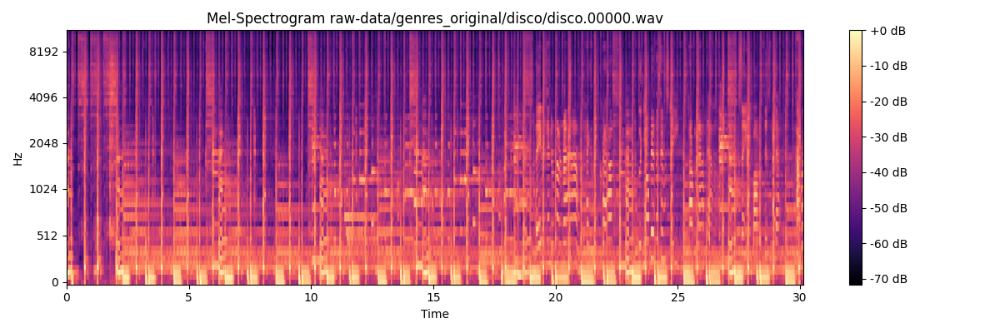
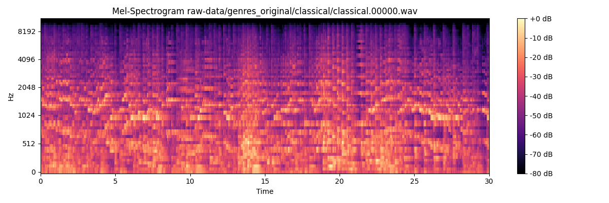
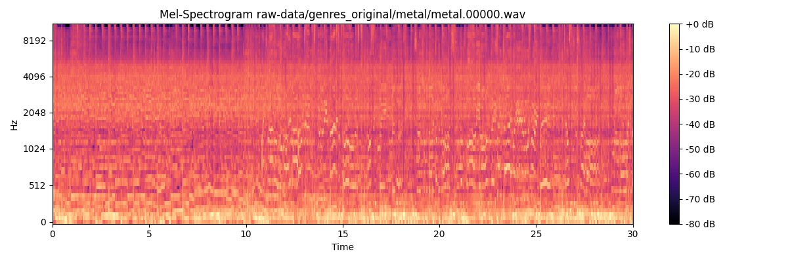

# Music classification

Dataset: GTZAN

30 second audio files - 100 per class

Classes:

1. blues
1. classical
1. country
1. disco
1. hiphop
1. jazz
1. metal
1. pop
1. reggae
1. rock

# Preprocessing

Extract mel-spectrogram and Normalise

Prepared for training by splitting the mel-spectrogram into sequences

# Models trained and tested

1. LSTM
1. BiLSTM
1. GRU
1. BiGRU
1. TCN
1. Conv1D

# Evaluation

**Good at classical and metal**:

Final BiGRU:

1. Accuracy: 0.71
1. Precision: 0.71
1. Recall: 0.71
1. F1 Score: 0.71

# Problems and Reflections

1. Limited knowledge and experience developing with audiofiles
1. Spent a lot of time fetching and managing the dataset properly
1. Caching datasets to optimise training doesn't work with very large files
1. Limited examples online
1. Training was very time-consuming
1. Had an error where the label didn't match the audiofiles (tried hyper-parameter tuning, dropout and normalising without any success)
1. Would have liked to try more techniques + proper hyper-parameter tuning (grid-search)
